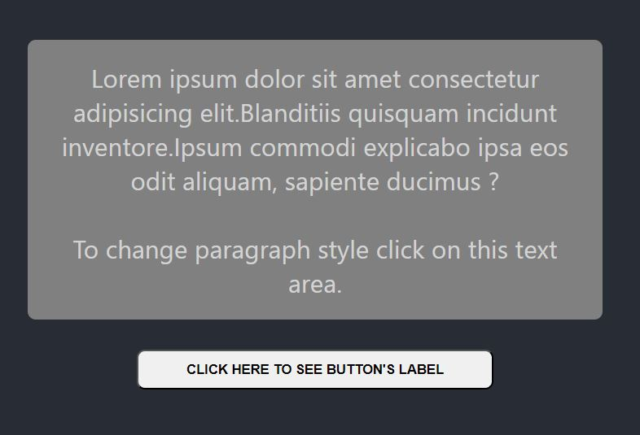
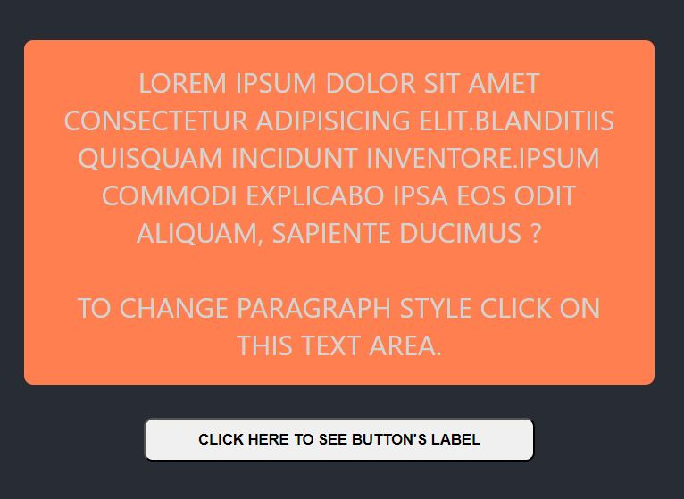

# Basic React Challenge

This is a solution to the DevQuest Challenge.

## Available Scripts

In the project directory, you can run:

### `npm start`

Runs the app in the development mode.\
Open [http://localhost:3000](http://localhost:3000) to view it in your browser.

The page will reload when you make changes.\
You may also see any lint errors in the console.

### `npm test`

Launches the test runner in the interactive watch mode.\
See the section about [running tests](https://facebook.github.io/create-react-app/docs/running-tests) for more information.

### `npm run build`

Builds the app for production to the `build` folder.\
It correctly bundles React in production mode and optimizes the build for the best performance.

The build is minified and the filenames include the hashes.\
Your app is ready to be deployed!

See the section about [deployment](https://facebook.github.io/create-react-app/docs/deployment) for more information.

## Table of contents

- [Overview](#overview)
  - [The challenge](#the-challenge)
  - [Screenshot](#screenshot)
  - [Links](#links)
- [My process](#my-process)
  - [Built with](#built-with)
  - [What I learned](#what-i-learned)
  - [Continued development](#continued-development)
- [Author](#author)

## Overview

### The challenge

Users should be able to:

- See an alert with the button's label when you click on the button
- Change the paragraph style when you click on the paragraph area.

### Screenshot
#### Default

#### Colorful

### Links

- Solution URL: [Solution URL - Repository](https://github.com/julialimp/quest-react)

## My process

### Built with

- CSS custom properties
- JavaScript
- React.js
- Components
- useState and useContext hooks

### What I learned

With this project I was able to put in practice the use of components with the use of hooks such as useState, useContext and createContext. I had some difficulty to make the paragraph style changing work, but I did a lot of research and could make it work the way I expected.

### Continued development

Even being able to make everything work, it took me a long time to connect everything and elaborate the logical process of the project, so I can see I have to pratice more often to make it in an easier way and more functional.

## Author

- Linkedin - [Juia Limp](https://www.linkedin.com/in/julia-limp-de-almeida-675953121?lipi=urn%3Ali%3Apage%3Ad_flagship3_profile_view_base_contact_details%3BZJi4VgNnTlSIG5FKPrpXAg%3D%3D)
- Instagram - [@julialimp](https://www.instagram.com/julialimp)
- GitHub - [@julialimp](https://github.com/julialimp)

